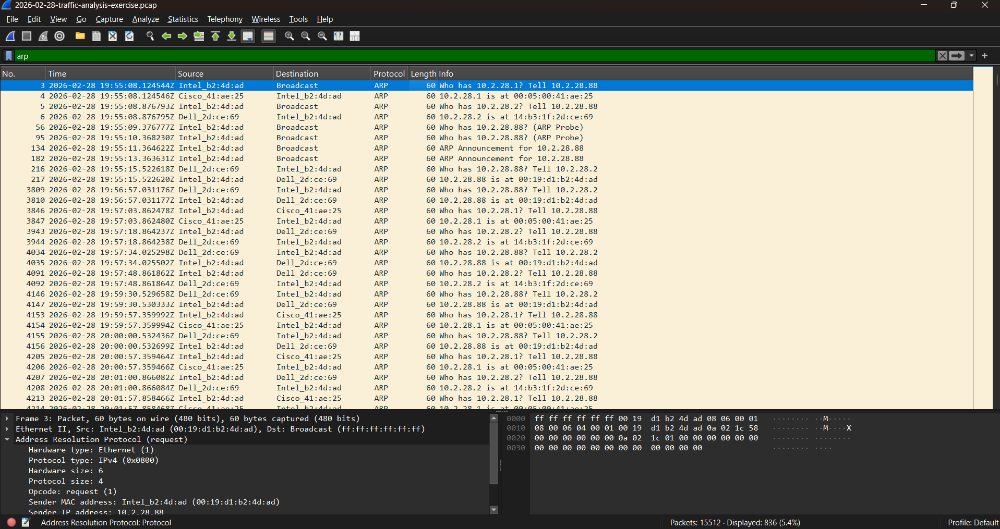
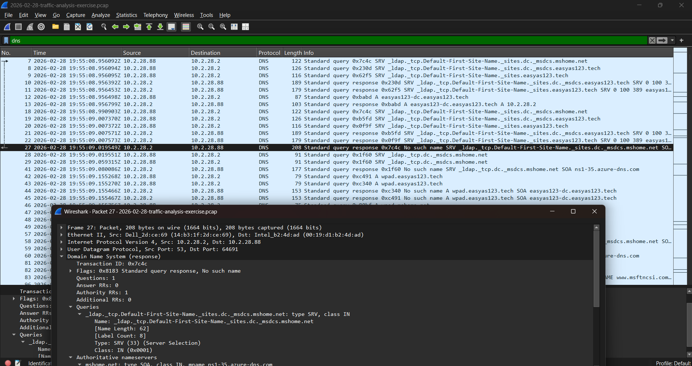
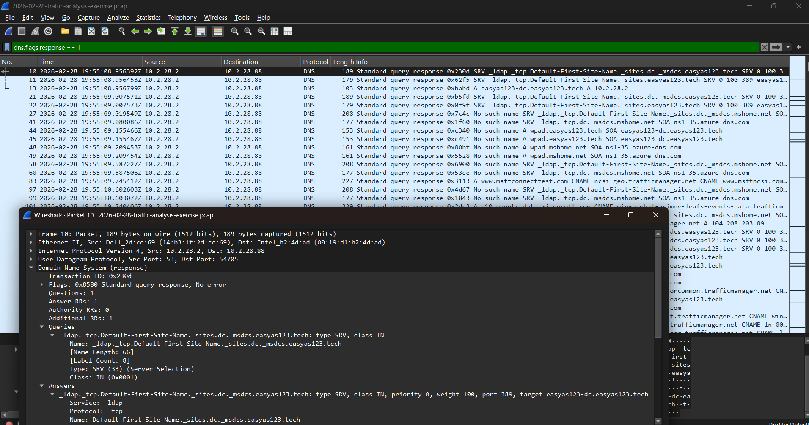
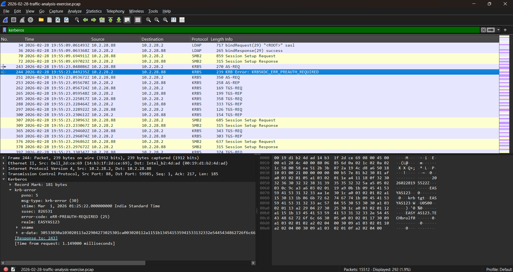
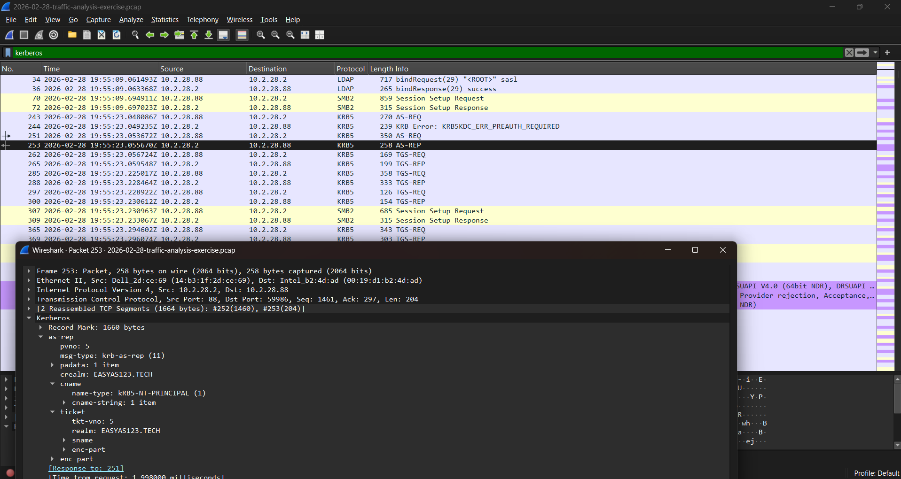

# Case Sudy 01 - Windows Active Directory Authentication - Wireshark Investigation

## Overview

This investigation analyzes a packet capture of a Windows client authenticating within an Active Directory environment. The objective was to reconstruct the authentication process, identify the protocols involved, and understand how Windows discovers and communicates with directory services.

---

# Investigation Objectives

- Analyze the complete Windows authentication process.
- Identify the role of each protocol involved.
- Understand Active Directory service discovery.
- Interpret Kerberos authentication traffic.
- Reconstruct the sequence of events from packet evidence.

---

# Tools Used

| Tool | Purpose |
|------|---------|
| Wireshark | Packet capture analysis |
| TCP/IP Knowledge | Protocol analysis |
| Windows Active Directory Concepts | Authentication workflow |

---

# Network Overview

| Device | IP Address | Observed Role |
|---------|-----------|---------------|
| Windows Client | 10.2.28.88 | Initiated authentication |
| Server | 10.2.28.2 | Responded to DNS-resolved LDAP/Kerberos requests |

---

# Protocols Observed

- DHCP
- ARP
- DNS
- CLDAP
- Kerberos
- LDAP
- SMB2

---

# Investigation Timeline

## Step 1 – DHCP

The first observed activity was a DHCP request.

### Observation

- Client requested network configuration.
- Client received IP address:

```
10.2.28.88
```


### Conclusion

The system was obtaining network configuration before communicating with other devices.

---

## Step 2 – ARP

The client immediately sent an ARP request.

### Observation

```
Who has 10.2.28.1?
Tell 10.2.28.88
```


### Conclusion

The client resolved the MAC address of the default gateway before external communication.

---

## Step 3 – DNS Service Discovery

The client attempted to locate Active Directory services.

### First DNS Query

```
_ldap._tcp.dc._msdcs.mshome.net
```

### Response

```
NXDOMAIN
```



An SOA record was included in the response.

### Analysis

This indicates that the requested DNS record was not found. The presence of the SOA record was part of the negative DNS response and did not indicate that the client requested an SOA record.

---

## Step 4 – Additional DNS Queries

Several additional DNS requests followed.

One of the later responses returned:

- SRV Record
- A Record

The A record resolved the server to:

```
10.2.28.2
```

### Analysis

The successful SRV response provided the location of the requested service, while the A record resolved the hostname to an IP address. The client then began communicating with 10.2.28.2.

---

## Step 5 – CLDAP

Immediately after successful DNS resolution, CLDAP communication began.

### Analysis

This behavior is consistent with Active Directory service discovery, where the client contacts a directory service after locating it through DNS.

---

## Step 6 – Kerberos Authentication

The Kerberos exchange consisted of several stages.

### Initial Authentication Request

```
AS-REQ
```

Client:

```
10.2.28.88
```

Server:

```
10.2.28.2
```

---

### Kerberos Error

The server returned:

```
KDC_ERR_PREAUTH_REQUIRED
```


### Analysis

This is expected behavior in a normal Kerberos authentication process. The Key Distribution Center requested Kerberos pre-authentication before issuing a Ticket Granting Ticket (TGT).

This response alone does not indicate authentication failure or malicious activity.

---

### Second Authentication Request

The client retransmitted the AS-REQ with the required pre-authentication information.

The server successfully replied with:

```
AS-REP
```


### Analysis

The client successfully obtained a Ticket Granting Ticket (TGT).

---

## Step 7 – Ticket Granting Service

Following successful authentication, the client requested access to network services.

Observed packets:

```
TGS-REQ
↓

TGS-REP
```

### Analysis

The client successfully received service tickets required for access to domain services.

---

## Step 8 – LDAP

LDAP communication followed successful Kerberos authentication.

### Analysis

This indicates the client accessed directory services after authentication.

---

## Step 9 – SMB2

SMB2 communication occurred after LDAP.

### Analysis

The observed sequence is consistent with authenticated access to network resources.

---

# Overall Communication Flow

```text
DHCP
↓

ARP
↓

DNS

↓

SRV Record Discovery

↓

A Record Resolution

↓

CLDAP

↓

Kerberos

AS-REQ
↓

KDC_ERR_PREAUTH_REQUIRED
↓

AS-REQ
↓

AS-REP
↓

TGS-REQ
↓

TGS-REP

↓

LDAP

↓

SMB2
```

---

# Key Findings

- The client obtained IP address 10.2.28.88 through DHCP.
- The client resolved the gateway using ARP.
- Initial DNS lookup returned NXDOMAIN.
- Subsequent DNS queries successfully located the requested service.
- An SRV record identified the service.
- An A record resolved the service hostname to 10.2.28.2.
- CLDAP communication followed successful DNS resolution.
- Kerberos authentication initially returned KDC_ERR_PREAUTH_REQUIRED.
- The client successfully completed Kerberos pre-authentication.
- Ticket Granting Ticket acquisition completed successfully.
- Service tickets were requested and issued successfully.
- LDAP and SMB2 communication followed successful authentication.

---

# Security Assessment

Based on the analyzed packets:

- No evidence of brute-force authentication attempts was observed.
- The Kerberos error was consistent with the normal pre-authentication process.
- The authentication sequence completed successfully.
- The observed communication followed the expected Windows Active Directory authentication workflow.

---

# Skills Demonstrated

- Wireshark Packet Analysis
- Network Traffic Investigation
- TCP/IP Analysis
- DNS Analysis
- Active Directory Service Discovery
- Kerberos Authentication Analysis
- LDAP Traffic Analysis
- SMB2 Traffic Analysis
- Timeline Reconstruction
- Evidence-Based Security Investigation

---

# Lessons Learned

This investigation demonstrated how multiple network protocols work together during Windows authentication.

Key observations include:

- DNS may perform multiple queries before successfully locating Active Directory services.
- An initial NXDOMAIN response does not necessarily indicate a problem.
- SRV records are essential for locating Active Directory services.
- KDC_ERR_PREAUTH_REQUIRED is a normal part of the Kerberos authentication process.
- Kerberos authentication precedes LDAP and SMB communication.
- Reconstructing packet timelines provides greater insight than analyzing individual packets in isolation.

---

# Future Improvements

Future investigations will focus on:

- HTTP/HTTPS traffic analysis
- SSH authentication
- DNS tunneling detection
- Port scan detection
- Brute-force attack analysis
- Malware network traffic analysis
- Incident response case studies